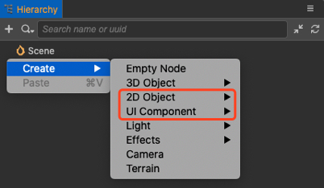

# 创建 2D 对象

## 创建 2D 节点

我们在编辑器内置了一些常用的 2D 渲染节点和 UI 节点方便用户直接使用。可以在 **层级管理器** 面板中点击左上方的 **+** 按钮，或者在 **层级管理器** 面板点击右键，此时就会出现 **2D 对象** 和 **UI 组件** 分类，按需选择节点。创建出的节点自动成为 Canvas 的子节点，如果此时场景没有 Canvas，编辑器会主动创建 Canvas，并自动将该节点放置于 Canvas 下。



## 添加 2D 组件

1. 可以通过选中节点，在 **属性检查器** 面板中点击 **添加组件**，会出现 **2D** 和 **UI** 分类，根据分类查看和添加组件。


2. 通过脚本添加：

```ts
// 此处以添加 2D 粒子组件为例
import { _decorator, Component, Node, ParticleSystem2D } from 'cc';
const { ccclass, property } = _decorator;

@ccclass('Example')
export class Example extends Component {
    start () {
        // 创建一个节点
        const node = new Node('atom');
        // 将该节点成为自身的兄弟节点
        node.parent = this.node.parent;
        // 添加 2D 粒子组件
        const particle2D = node.addComponent(ParticleSystem2D);
    }
}
```
