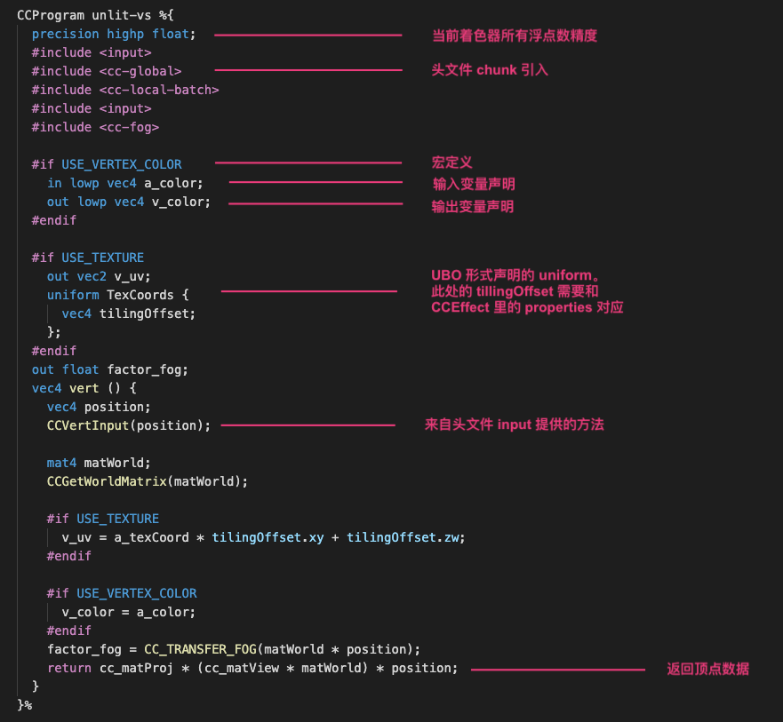

# Shader 书写格式

## Shader 片段

Shader 片段在语法上基于 GLSL 300 ES，在资源加载时有相应的预处理编译流程。

这一节会介绍所有“领域特定”的扩展语法，更多实际使用示例，可参考编辑器内提供的 builtin effect。

在 EffectAsset 文件中任何着色器内容都需要包在 **CCProgram** 语法块内：

```yaml
CCProgram 着色器名 %{
  # YAML starts here
}%
```

这里以 unlit 顶点着色器（可以在编辑器资源下的 internal 下找到 builtin-unlit.effect 文件）为例展示 CCProgram 内的结构如下：



## Shader 片段声明说明

在标准 GLSL 语法上，Creator 引入了以下几种非常自然的 C 风格语法扩展。

### Include 机制

类似 C/C++ 的头文件 include 机制，你可以在任意 shader 代码（CCProgram 块或独立的头文件 chunk）中引入其他代码片段：

```c
#include <cc-global>
#include "../headers/my-shading-algorithm.chunk"
```

相关规则和注意事项：
- 头文件默认扩展名为 `.chunk`，包含时可省略。尖括号和双引号没有区别；
- 在编译期的头文件展开过程中，每个头文件保证只会被展开一次，所以书写时不必担心，每个模块都可以（也应该）包含自己依赖的头文件，即使这中间有重复；
- 更进一步地，所有不参与运行时实际计算流程的函数声明也都会在编译期就被剔除，所以可以放心包含各类工具函数；
- 头文件引用可以指定基于当前文件目录的相对路径（以下统称"相对路径"），也可以指定基于 `assets/chunks` 目录的相对路径（以下统称"项目绝对路径"），两个位置如果有同名文件，则后者优先；
- 引用了编辑器其他 DB 的头文件（Internal 或各类插件 DB 等）只能指定项目绝对路径。当多个 DB 在此路径下有相同文件时，优先级为：用户项目 DB > 插件 DB > Internal DB；
- 编辑器内置头文件资源就在 internal DB 的 `assets/chunks` 目录下，所以可以不加目录直接引用，主要包括一些常用的工具函数和标准光照模型等。
- 所有在同一个 effect 文件中声明的 CCProgram 代码块都可以相互引用。

### 预处理宏定义

目前 Effect 系统的设计倾向于在游戏项目运行时可以方便地利用 shader 中的各类预处理宏，进而减少 runtime branching。<br>
编辑器会在加载资源时收集所有在 shader 中出现的 defines，然后引擎在运行时动态地将需要的声明加入 shader 内容。所以如果要使用这些预处理宏，只需要像上面的截图例子一样，在 shader 中直接进行逻辑判断即可。所有的 define 都会被序列化到 **属性检查器** 上，以便随时调整。

**注意**：
- 为尽可能多地在编译期做类型检查，目前的策略是直接将所有自定义宏设置为 true（或根据 Macro Tags 指定的默认值）再交给后端尝试检查。所以如果在设计上某些宏之间存在互斥关系（不可能同时为 true）的话，应统一使用一个通过 tag 声明的宏来处理；
- 运行时会显式定义所有 shader 中出现的自定义宏（默认定义为 0），所以 **除了 GLSL 语言内置宏外（`GL_` 开头的 extension 等）**，请不要使用 `#ifdef` 或 `#if defined` 这样的形式做判断，否则执行结果会始终为 true；
- 运行时会对宏定义组合计算 hash，目前的计算机制在宏定义组合数 **2^32** 以内（一个 int 的范围），相对高效，对应到 shader 中相当于 32 个 boolean 开关。所以请尽量不要超出此限制，定义过多运行时可调整的宏定义，会影响运行效率。

### Macro Tags

虽然引擎会尝试自动识别所有出现在预处理分支逻辑中 (#if) 的宏定义，但有时实际使用方式要比简单的布尔开关更复杂一些，如：

```glsl
// macro defined within certain numerical 'range'
#if LAYERS == 4
  // ...
#elif LAYERS == 5
  // ...
#endif
// multiple discrete 'options'
float metallic = texture(pbrMap, uv).METALLIC_SOURCE;
```

针对这类有固定取值范围或固定选项的宏定义，需要选择一个合适的 tag 显式声明：

| Tag     | 说明                                              | 默认值                       | 备注                                                                                            |
|---------|-------------------------------------------------|------------------------------|-----------------------------------------------------------------------------------------------|
| range   | 一个长度为 2 的数组。首元素为最小值，末元素为最大值 | [0, 3]                       | 针对连续数字类型的宏定义，显式指定它的取值范围。<br>范围应当控制到最小，有利于运行时的 shader 管理 |
| options | 一个任意长度的数组，每个元素都是一个可能的取值     | 如未显式声明则不会定义任何宏 | 针对有清晰选项的宏定义，显式指定它的可用选项                                                     |

比如下面这样的声明：

```glsl
#pragma define LAYERS range([4, 5])
#pragma define METALLIC_SOURCE options([r, g, b, a])
```

一个是名为 `LAYERS` 的宏定义，它在运行时可能的取值范围为 `[4, 5]`。<br>
另一个是名为 `METALLIC_SOURCE` 的宏定义，它在运行时可能的取值为 'r'、'g'、'b'、'a' 四种。

**注意**：语法中的每个 tag 都只有一个参数，这个参数可以直接用 YAML 语法指定。

### Functional Macros

由于 WebGL1 不支持原生，Creator 将函数式宏定义提供为 effect 编译期的功能，输出的 shader 中就已经将此类宏定义展开。这非常适用于 inline 一些简单的工具函数，或需要大量重复定义的相似代码。事实上，内置头文件中不少工具函数都是函数式宏定义：

```glsl
#define CCDecode(position) \
  position = vec4(a_position, 1.0)
#define CCVertInput(position) \
  CCDecode(position);         \
  #if CC_USE_SKINNING         \
    CCSkin(position);         \
  #endif                      \
  #pragma // empty pragma trick to get rid of trailing semicolons at effect compile time
```

但与 C/C++ 的宏定义系统相同，这套机制不会对宏定义的 [卫生情况](https://en.wikipedia.org/wiki/Hygienic_macro) 做任何处理，由不卫生的宏展开而带来的问题需要开发者自行处理，因此我们推荐，并也确保所有内置头文件中，谨慎定义含有局部变量的预处理宏：

```glsl
// please do be careful with unhygienic macros like this
#define INCI(i) do { int a=0; ++i; } while(0)
// when invoking
int a = 4, b = 8;
INCI(b); // correct, b would be 9 after this
INCI(a); // wrong! a would still be 4
```

### Vertex Input<sup id="a1">[1](#f1)</sup>

为对接骨骼动画与数据解压流程，我们提供了 `CCVertInput` 工具函数，对所有 3D 模型使用的 shader，可直接在 vs 开始时类似这样写：

```glsl
#include <input>
vec4 vert () {
  vec3 position;
  CCVertInput(position);
  // ... do your thing with `position` (models space, after skinning)
}
```

如果还需要法线等信息，可直接使用 standard 版本：

```glsl
#include <input-standard>
vec4 vert () {
  StandardVertInput In;
  CCVertInput(In);
  // ... now use `In.position`, etc.
}
```

这会返回模型空间的顶点位置（position）、法线（normal）和切空间（tangent）信息，并对骨骼动画模型做完蒙皮计算。

**注意**：引用头文件后，不要在 shader 内重复声明这些 attributes（a_position 等）。对于其他顶点数据（如 uv 等）还是正常声明 attributes 直接使用。

另外如果需要对接引擎动态合批和 instancing 流程，需要包含 `cc-local-batch` 头文件，通过 `CCGetWorldMatrix` 工具函数获取世界矩阵：

```glsl
// unlit version (when normal is not needed)
mat4 matWorld;
CCGetWorldMatrix(matWorld);
// standard version
mat4 matWorld, matWorldIT;
CCGetWorldMatrixFull(matWorld, matWorldIT);
```

关于更多 shader 内置 uniform，可以参考 [完整列表](builtin-shader-uniforms.md)。

### Fragment Ouput<sup id="a1">[1](#f1)</sup>

为对接引擎渲染管线，Creator 提供了 `CCFragOutput` 工具函数，对所有无光照 shader，都可以直接在 fs 返回时类似这样写：

```glsl
#include <output>
vec4 frag () {
  vec4 o = vec4(0.0);
  // ... do the computation
  return CCFragOutput(o);
}
```

这样中间的颜色计算就不必区分当前渲染管线是否为 HDR 流程等。<br>
如需包含光照计算，可结合标准着色函数 `CCStandardShading` 一起构成 surface shader 流程：

```glsl
#include <shading-standard>
#include <output-standard>
void surf (out StandardSurface s) {
  // fill in your data here
}
vec4 frag () {
  StandardSurface s; surf(s);
  vec4 color = CCStandardShading(s);
  return CCFragOutput(color);
}
```

在此框架下可方便地实现自己的 surface 输入，或其他 shading 算法。

**注意**：`CCFragOutput` 函数一般还是不需要自己实现，它只起到与渲染管线对接的作用，且对于这种含有光照计算的输出，因为计算结果已经在 HDR 范围，所以应该包含 `output-standard` 而非 `output` 头文件。

### 自定义 Instanced 属性

通过 instancing 动态合批的功能十分灵活，在默认的流程上，开发者可以加入更多 instanced 属性。如果要在 shader 中引入新的属性，那么所有相关处理代码都需要依赖统一的宏定义 `USE_INSTANCING`：

```glsl
#if USE_INSTANCING // when instancing is enabled
  #pragma format(RGBA8) // normalized unsigned byte
  in vec4 a_instanced_color;
#endif
```

**注意**：
- 这里可以使用编译器提示 `format` 指定此属性的具体数据格式，参数为引擎 `GFXFormat` 的任意枚举名<sup id="a2">[2](#f2)</sup>，如未声明则默认为 32 位 float 类型；
- 所有 instanced 属性都是 VS 的输入 attribute，所以如果要在 FS 中使用，则需要在 VS 中自行传递；
- 记得确保代码在所有分支都能正常执行，无论 `USE_INSTANCING` 启用与否。

在运行时所有属性都会默认初始化为 0，脚本中设置接口为：

```ts
const comp = node.getComponent(MeshRenderer);
comp.setInstancedAttribute('a_instanced_color', [100, 150, 200, 255]); // should match the specified format
```

**注意**：在每次重建 PSO 时（一般对应更换新材质时）所有属性值都会重置，需要重新设置。

### WebGL 1 fallback 支持

由于 WebGL 1 仅支持 GLSL 100 标准语法，在 effect 编译期会提供 300 es 转 100 的 fallback shader，所以开发者基本不需关心这层变化。<br>
但需要注意的是目前的自动 fallback 只支持一些基本的格式转换，如果使用了 300 es 独有的 shader 函数（texelFetch、textureGrad 等）或 extension，我们推荐根据 `\_\_VERSION__` 宏定义判断 shader 版本，自行实现更稳定精确的 fallback：

```glsl
#if __VERSION__ < 300
#ifdef GL_EXT_shader_texture_lod
  vec4 color = textureCubeLodEXT(envmap, R, roughness);
#else
  vec4 color = textureCube(envmap, R);
#endif
#else
  vec4 color = textureLod(envmap, R, roughness);
#endif
```

在 effect 编译期我们会尝试解析所有已经为常量的宏控制流，将实际内容做剔除或拆分到不同版本的 shader 输出中。

### 关于 UBO 内存布局

Creator 规定在 shader 中所有非 sampler 的 uniform 都应以 block 形式声明，且对于所有 UBO：
1. 不应出现 vec3 成员；
2. 对数组类型成员，每个元素 size 不能小于 vec4；
3. 不允许任何会引入 padding 的成员声明顺序。

这些规则都会在 effect 编译期做对应检查，以便在导入错误（implicit padding 相关）形式时提醒修改。

这可能听起来有些过分严格，但背后有非常务实的考量：<br>
首先，UBO 是渲染管线内要做到高效数据复用的唯一基本单位，离散声明已不是一个选项；<br>
其次，WebGL2 的 UBO 只支持 std140 布局，它遵守一套比较原始的 padding 规则：<sup id="a3">[3](#f3)</sup>

- 所有 vec3 成员都会补齐至 vec4：

  ```glsl
  uniform ControversialType {
    vec3 v3_1; // offset 0, length 16 [IMPLICIT PADDING!]
  }; // total of 16 bytes
  ```

- 任意长度小于 vec4 类型的数组和结构体，都会将元素补齐至 vec4：

  ```glsl
  uniform ProblematicArrays {
    float f4_1[4]; // offset 0, stride 16, length 64 [IMPLICIT PADDING!]
  }; // total of 64 bytes
  ```

- 所有成员在 UBO 内的实际偏移都会按自身所占字节数对齐<sup id="a4">[4](#f4)</sup>：

  ```glsl
  uniform IncorrectUBOOrder {
    float f1_1; // offset 0, length 4 (aligned to 4 bytes)
    vec2 v2; // offset 8, length 8 (aligned to 8 bytes) [IMPLICIT PADDING!]
    float f1_2; // offset 16, length 4 (aligned to 4 bytes)
  }; // total of 32 bytes

  uniform CorrectUBOOrder {
    float f1_1; // offset 0, length 4 (aligned to 4 bytes)
    float f1_2; // offset 4, length 4 (aligned to 4 bytes)
    vec2 v2; // offset 8, length 8 (aligned to 8 bytes)
  }; // total of 16 bytes
  ```

这意味着大量的空间浪费，且某些设备的驱动实现也并不完全符合此标准<sup id="a5">[5](#f5)</sup>，因此目前 Creator 选择限制这部分功能的使用，以帮助排除一部分非常隐晦的运行时问题。<br>

> **注意**：再次提醒，uniform 的类型与 inspector 的显示和运行时参数赋值时的程序接口可以不直接对应，通过 [property target](pass-parameter-list.md#Properties) 机制，可以独立编辑任意 uniform 具体的分量。

<b id="f1">[1]</b> 不包含粒子、sprite、后效等不基于 mesh 执行渲染的 shader [↩](#a1)<br>
<b id="f2">[2]</b> 注意 WebGL 1.0 平台下不支持整型 attributes，如项目需要发布到此平台，应使用默认浮点类型 [↩](#a2)<br>
<b id="f3">[3]</b> [OpenGL 4.5, Section 7.6.2.2, page 137](http://www.opengl.org/registry/doc/glspec45.core.pdf#page=159) [↩](#a3)<br>
<b id="f4">[4]</b> 注意在示例代码中，UBO IncorrectUBOOrder 的总长度为 32 字节，实际上这个数据到今天也依然是平台相关的，看起来是由于 GLSL 标准的疏忽，更多相关讨论可以参考 [这里](https://bugs.chromium.org/p/chromium/issues/detail?id=988988) [↩](#a4)<br>
<b id="f5">[5]</b> [Interface Block - OpenGL Wiki](https://www.khronos.org/opengl/wiki/Interface_Block_(GLSL)#Memory_layout) [↩](#a5)
